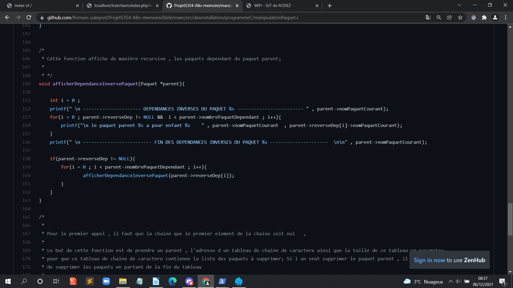
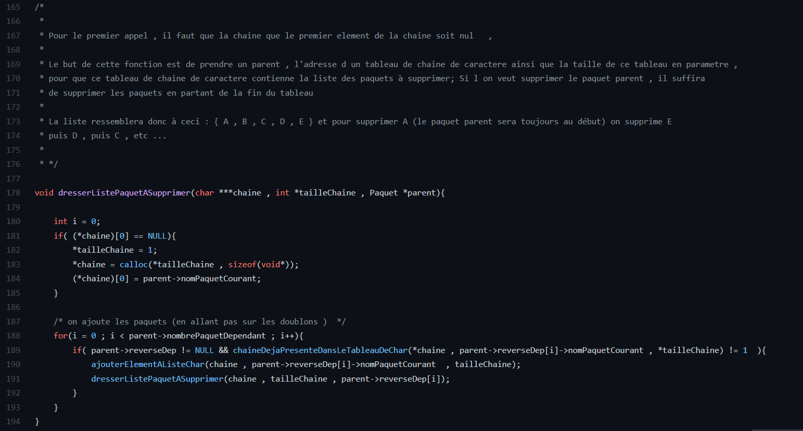
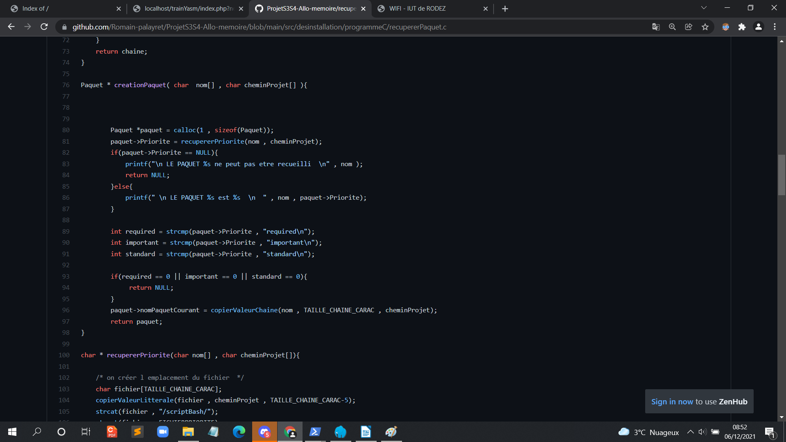
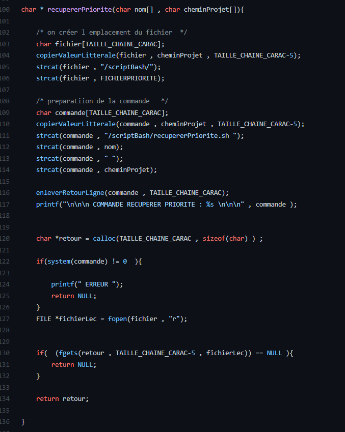
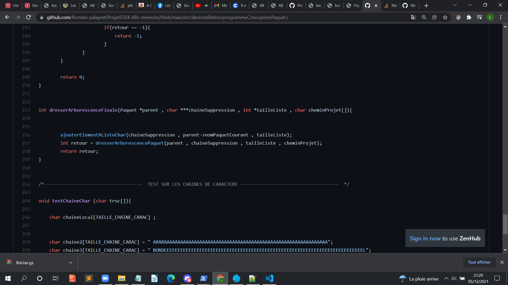
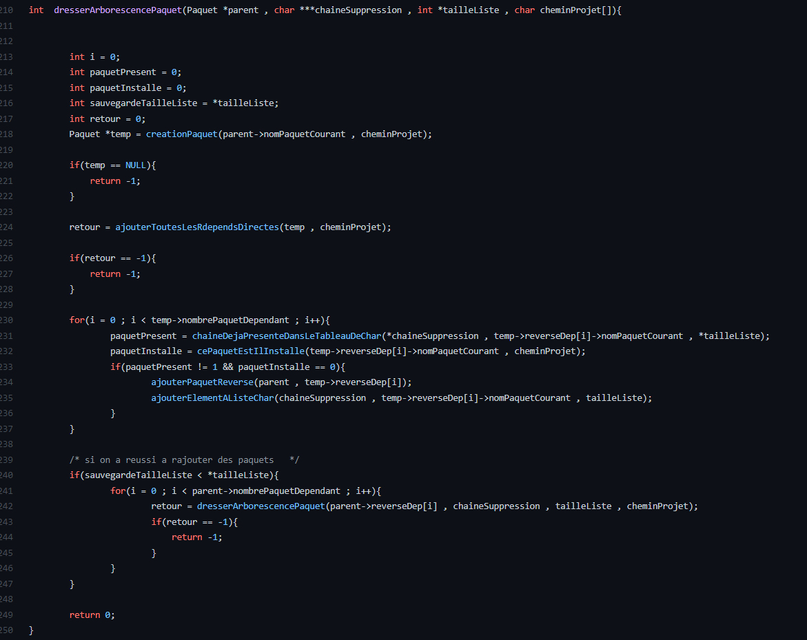

# Loup Salomé 

## Presentation de l'algorithme de desinstallation 

Les logiciels et fonctionnalités sont installés sous forme de paquet dans un système linux. Ces paquets sont gérés par des gestionnaires de paquet (apt et dpkg) et ils sont interdépendants entre eux. Lorsque l'on souhaite désinstaller un paquet , il est donc nécessaire de vérifier si ce paquet n'est pas une dépendance d'un paquet important
dans le système debian. 

## Les mentions Priority 

Les développeurs de debian ont donc pensé à ajouter des mentions Priority aux paquets.  Il existe donc 5 types de priorités (du plus important au moins important) required
important , standard , optionnal et enfin extra. On peut avoir accès à cette mention en tapant la commande apt show <nom du Paquet>. Il existe une commande  apt rdepends <paquetA>  qui permet d'obtenir la liste des paquets dépendants du paquet A. Là aussi les relations entre les dépendances ne sont pas équivalentes. 
  
## Les mentions de dépendance 
  
  Il existe plusieurs niveau d'intensite de dépendance entre les paquet sur le système débian. Les dépendances vitales des paquets sont les suivantes : 
 
  -Mentions: 
    - Depends 
    - Suggest 
    - Provides
  
  

## Fonction affichage des Dependances Inverses du paquet 

Cette fonction prend en paramètre un paquet parent. A partir de ce paquet parent , 
la fonction va afficher toutes les rdepends du paquets , puis elle sera éxécutée
récursivement sur chaque paquet dépendant du paquet parent.
Ainsi , l’intégralité de l’arbre des dépendances est parcouru. 

## Fonction de dressage de la liste de suppression à partir d’un paquet parent : 

Cette fonction prend en parametre un un paquet parent , une tableau de chaine de caractère qui permettra
de stocker la liste des paquets à supprimer. L'algorithme sera le suivant : 

On parcourt l'arborescence de façon récursive de la même manière que l'on a fait pour l'affichage des dépendances
inverses. Sauf que cette fois ci , on ajoute le nom du paquet Parent à chaque appel Récursif. Si le paquet existe 
déjà dans la liste de Suppression , il ne sera pas ajouté. 

## Fonction création Paquet 

 

La fonction création Paquet Fonctionne de la manière suivante. On passe en paramètre un nom de Paquet ainsi que le chemin Absolue du projet. On appelle 
ensuite le scriptBash RecupererPriorite.sh , qui créera un fichier priorite.txt dans le dossier scriptBash. La fonction va ensuite récupérer la priorité 
dans ce fichier texte. Si la priorité relevée est standard , required ou important. La fonction créerPaquet renverra null. Si cette fonction renvoit nulle , le programme
appelant se mettra en erreur et renverra un code d'erreur. 

## fonction RecupererPriorite 

 

Cette fonction s'occupe de récupérer la priorité pour la fonction création Paquet. 

# FONCTION PRINCIPALE 

## fonction Enveloppe Dressage Arborescence Paquet : 

 

Cette fonction sert de classe Enveloppe pour la fonction dressage de l'arborescence. Etant donné 
que dresser l'arborescence est une classe récursive. Cette classe enveloppe est donc nécessaire 

## fonction Dressage Arborescence Recursive 

Cette fonction s'occupe de dresser l'arborescence des paquets de façon récursive. A chaque ajout de Paquet
dans une structure en mémoire , on ajoute le nom du paquet dans la liste. Si le paquet figure 
dans le tableaux de cahine de caractère , le paquet ne sera pas ajouté. 

