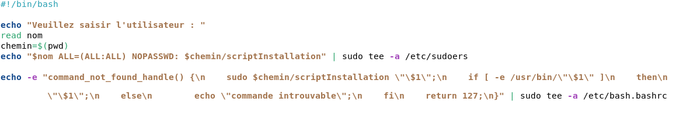
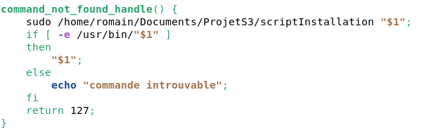

# Documentation du programme d'installation :

## Description générale
Le programme _lancer_ est un script bash s'occupant de l'installation du logiciel.
Lancé par l'administrateur, il permet d'integrer le logiciel à la machine Debian.

Ce programme modifie :
- /etc/sudoers         En ajoutant les droits d'installation de paquet à un utilisateur donné.
- /etc/bash.bashrc     En ajoutant la fonction _command\_not\_found\_handle()_ qui appelera le script bash _scriptInstallation_ pour installer un paquet
                       lorsque le paquet tapé dans la console n'est pas déjà installé.

## Description de la conception et réalisation du script
Au debut du script, on demande à l'administrateur de saisir le nom de l'utilisateur a qui il veut installer le logiciel.
Ce nom est nescessaire car on lui donnera les droits d'installation afin que le logiciel puisse installer des paquets sans demander le mot de passe administrateur a chaque fois. Il sera utilisé pour la modification du fichier _/etc/sudoers_.
On récupère ensuite dans une variable _chemin_ le chemin du script _lancer_, car on suppose qu'il a le même chemin que le script _scriptInstallation_. En effet, connaître le chemin de _scriptInstallation_ est nescessaire car on appelera ce script dans la fonction _command\_not\_found\_handle()_.

 

On écrit ensuite dans le fichier /etc/sudoers la ligne suivante. Elle donnera à l'utilisateur dont le nom a été saisi plus tôt les droits d'installation de paquet.

On écrit ensuite dans le fichier /etc/bash.bashrc la fonction suivante. Elle sera appellée lorsqu'une commande introuvable est inscrite dans la console. Elle essayera d'installer la un paquet qui a pour nom la commande introuvable en question. Si aucun paquet ne correspond au nom indiqué, alors elle marque sur la console _commande introuvable_. Mais si le paquet existe, alors elle l'installera et l'ouvrira automatiquement dès la fin de l'installation.

