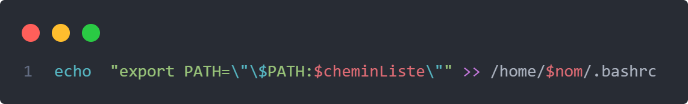

# Documentation du programme d'installation :

## Description générale
Le programme _lancer_ est un script bash s'occupant de l'installation du logiciel.
Lancé par l'administrateur, il permet d'integrer le logiciel à la machine Debian.

Ce programme modifie :
- /etc/sudoers         En ajoutant les droits d'installation et de désinstallation de paquet à un utilisateur donné.
- /etc/bash.bashrc     En ajoutant la fonction _command\_not\_found\_handle()_ qui appelera le script bash _scriptInstallation_ pour installer un paquet
                       lorsque le paquet tapé dans la console n'est pas déjà installé.
- /home/$nom/.bashrc   En ajoutant au PATH le chemin où sont stockée les listes pour pouvoir executées les listes n'importe où dans la console
- /etc/crontab         En ajoutant les lignes pour executer regulierment le programme de desinstallation

## Outils utilisés : 
Le script _lancer_ a été codé sur l'editeur texte _nano_ et testé sur l'environnement Debian

## Description de la conception et réalisation du script

Au debut du script, on demande à l'administrateur de saisir le nom de l'utilisateur a qui il veut installer le logiciel.
Ce nom est nescessaire car on lui donnera les droits d'installation afin que le logiciel puisse installer des paquets sans demander le mot de passe administrateur a chaque fois. Il sera utilisé pour la modification du fichier _/etc/sudoers_.
On récupère ensuite dans une variable _chemin_ le chemin du script _lancer_, car on suppose qu'il a le même chemin que le script _scriptInstallation_. En effet, connaître le chemin de _scriptInstallation_ est nescessaire car on appelera ce script dans la fonction _command\_not\_found\_handle()_.

```
#On demande de saisir le nom de l'utilisateur pour lequel on veut installer serec
echo "Veuillez saisir l'utilisateur : "
read nom
#Le fichier lancer doit être executer dans son dossier, et pas en dehors
chemin=$(pwd)
```
La suite du programme est découpée en 5 partie. Ces parties correspondent à chaque modifications de fichier qu'effectue le script _lancer_ et donc à chaque fonctionnalités que ces modifications permettent.

### Command _command\_not\_found\_handle()_ :

Le morceau de code suivant permet d'ecrire la fonction _command\_not\_found\_handle()_ dans le fichier /etc/bash.bashrc. Cette fonction sera appellée lorsqu'une commande introuvable est inscrite dans la console. Elle essayera d'installer la un paquet qui a pour nom la commande introuvable en question. Si aucun paquet ne correspond au nom indiqué, alors elle marque sur la console _commande introuvable_. Mais si le paquet existe, alors elle l'installera et l'ouvrira automatiquement dès la fin de l'installation.

```
echo -e "command_not_found_handle() {\n    sudo $chemin/scriptInstallation \"\$1\";\n    if [ -e /usr/bin/\"\$1\" ]\n    then\n        \"\$1\";\n    else\n        echo \"commande introuvable\";\n    fi\n    return 127;\n}" | sudo tee -a /etc/bash.bashrc
```
Au cours du projet, nous nous sommes rendu compte que cette simple commande était insuffisante. En effet, si le script _lancer_ était executé plusieurs fois (pour définir plusieurs utilisateurs par exemple, ou par simple erreur humaine) La fonction _command\_not\_found\_handle()_ était écrite plusieurs fois. Si cette fonction est écrite plusieurs fois, alors elle n'est plus appelée par le système. Pour regler ce problème, nous allons ecrire le contenu de _/etc/bash.bashrc_ dans un fichier temporaire, afin de le parcourir plus facilement. On vérifie ensuite si la ligne de code ```command_not_found_handle() {``` est déjà écrite. Si c'est le cas, la fonction ne sera pas réécrite.

```
#On ecrit la fonction command_not_found_handle si elle n'existe pas déjà
cat /etc/bash.bashrc > bashrc
dejaEcrit=0
while read ligne
do
    if [[ $ligne == "command_not_found_handle() {" ]]
    then
        dejaEcrit=1
    fi
done < bashrc

if [ $dejaEcrit -eq "0" ]
then
echo -e "command_not_found_handle() {\n    sudo $chemin/scriptInstallation \"\$1\";\n    if [ -e /usr/bin/\"\$1\" ]\n    then\n        \"\$1\";\n    else\n        echo \"commande introuvable\";\n    fi\n    return 127;\n}" | sudo tee -a /etc/bash.bashrc
fi
rm bashrc
```

### Droits d'installations des paquets :

On écrit ensuite dans le fichier /etc/sudoers la ligne suivante. Elle donnera à l'utilisateur dont le nom a été saisi plus tôt les droits d'installation de paquet.
```echo "$nom ALL=(ALL:ALL) NOPASSWD: $chemin/scriptInstallation" | sudo tee -a /etc/sudoers```

Au cours du projet, nous nous sommes rendu compte que cette simple commande était insuffisante. En effet, si le script _lancer_ était executé plusieurs fois (pour définir plusieurs utilisateurs par exemple, ou par simple erreur humaine) La ligne de code ci-dessus était écrite plusieurs fois. Ecrire cette ligne une seconde fois peut-être nescessaire si le nom d'utilisateur est différent, mais si le nom d'utilisateur est le même cette réécriture n'est pas souhaitée. Pour regler ce problème, nous allons ecrire le contenu de _/etc/bash.bashrc_ dans un fichier temporaire, afin de le parcourir plus facilement. On vérifie ensuite si la ligne de code ci-dessus est déjà écrite. Si c'est le cas, la fonction ne sera pas réécrite.

```
#On ecrit la commande pour donner les droit d installation dans le fichier /etc/sudoers si elle n'existe pas déjà
cat /etc/sudoers > sudoer
dejaEcrit=0
while read ligne
do
    if [[ $ligne == "$nom ALL=(ALL:ALL) NOPASSWD: $chemin/scriptInstallation" ]]
    then
        dejaEcrit=1
    fi
done < sudoer

if [ $dejaEcrit -eq "0" ]
then
    echo "$nom ALL=(ALL:ALL) NOPASSWD: $chemin/scriptInstallation" | sudo tee -a /etc/sudoers
fi
rm sudoer

```

### Droits de désinstallation des paquets :

On écrit ensuite dans le fichier /etc/sudoers la ligne suivante. Elle donnera à l'utilisateur dont le nom a été saisi plus tôt les droits d'installation de paquet.
```echo "$nom ALL=(ALL:ALL) NOPASSWD: $chemin/scriptDesinstallation" | sudo tee -a /etc/sudoers```

Au cours du projet, nous nous sommes rendu compte que cette simple commande était insuffisante. En effet, si le script _lancer_ était executé plusieurs fois (pour définir plusieurs utilisateurs par exemple, ou par simple erreur humaine) La ligne de code ci-dessus était écrite plusieurs fois. Ecrire cette ligne une seconde fois peut-être nescessaire si le nom d'utilisateur est différent, mais si le nom d'utilisateur est le même cette réécriture n'est pas souhaitée. Pour regler ce problème, nous allons ecrire le contenu de _/etc/bash.bashrc_ dans un fichier temporaire, afin de le parcourir plus facilement. On vérifie ensuite si la ligne de code ci-dessus est déjà écrite. Si c'est le cas, la fonction ne sera pas réécrite.

```
#On ecrit la commande pour donner les droit de desinstallation dans le fichier /etc/sudoers si elle n'existe pas déjà
cat /etc/sudoers > sudoer
dejaEcrit=0
while read ligne
do
    if [[ $ligne == "$nom ALL=(ALL:ALL) NOPASSWD: $chemin/scriptDesinstallation" ]]
    then
        dejaEcrit=1
    fi
done < sudoer

if [ $dejaEcrit -eq "0" ]
then
    echo "$nom ALL=(ALL:ALL) NOPASSWD: $chemin/scriptDesinstallation" | sudo tee -a /etc/sudoers
fi
rm sudoer

```

On écrit ensuite dans le fichier /etc/sudoers la ligne suivante. Elle donnera à l'utilisateur dont le nom a été saisi plus tôt les droits de Desinstallation de paquet.


On écrit ensuite dans le fichier /etc/bash.bashrc la fonction suivante. Elle sera appellée lorsqu'une commande introuvable est inscrite dans la console. Elle essayera d'installer la un paquet qui a pour nom la commande introuvable en question. Si aucun paquet ne correspond au nom indiqué, alors elle marque sur la console _commande introuvable_. Mais si le paquet existe, alors elle l'installera et l'ouvrira automatiquement dès la fin de l'installation.


On lit ensuite dans le fichier serec.config ( dont le chemin est ecrit pour le moment en dur dans le programme, mais ce sera problème disparaitra tout seul quand on incluera le serveur serecd) le chemin des listes rouge, verte et orange. Ce chemin est écrit part l'administrateur lors de l'installation du paquet.

On ajoute ensuite a la fin du fichier /home/"nom de l'utilisateur"/.bashrc une ligne permettant d'executer les commandes permettant d'acceder aux listes depuis n'importe quel endroit de la console.


### Ligne pour l'accès aux listes

Avec cette ligne de code, le but est d'ajouter dans le fichier ***.bashrc*** une ligne qui ajoute à la variable d'environement PATH le chemin qui mène aux scripts d'accès aux listes pour pouvoir y accéder de n'importe où dans le répertoire

### Ajout de la ligne pour le lancement du script dReccur
Pour lancer un script automatiquement après un certain nombre de seconde il faut utiliser le programme ***cron***. Cron est un programme qui permet aux utilisateurs des systèmes Unix d’exécuter automatiquement des scripts, des commandes ou des logiciels à une date et une heure spécifiée à l’avance, ou selon un cycle défini à l’avance.  
Pour faire cela, nous allons préalablement mettre dans un fichier temporaire le contenu du fichier */etc/crontab* pour pouvoir le parcourir. Le but de le parcourir est de trouver si l'on a déjà ajouté une ligne contenant le chemin d'accés au script ***dReccur*** en faisant attention de ne pas prendre en compte la modification potentiel du temps modifié dans le fichier ***serec.config***. Ainsi si une ligne est trouvé on la supprime car elle a besoin d'ètre mise à jour avec la ligne de commande suivante

Comme paramètre de ce programme on y met le numéro de ligne précédement récupere lorsque l'on trouve la ligne. Avec l'option **-i.bak** on supprime définivement la ligne. Et pour finir on y ajoute le fichier dans lequel on veut supprimer la ligne.

Par la suite on ajoute donc la ligne suivante peu importe si elle a été trouvé précédement.

Dans cette ligne de code, on récupère le nombre de seconde présiser dans le fichier ***serec.config*** que l'on divise par 60 pour obtenir des minutes. Ensuite nous optenons par exemple la ligne suivante :  
`*/22 * * * * root bash monScript`  
Cette ligne ce traduit par : Toutes les 10 minutes alors le script bash du nom de ***monScript*** sera executé. C'est exactement ce que nous voulons. Juste après cette ligne est ajoutée au fichier */etc/crontab*.

### Gestion des erreurs
Le programme lancer présenté ci-dessus fonctionne parfaitement, s'il n'est lancé qu'une seule fois.
En effet, s'il est lancé plusieurs fois d'affilées, il écrit la fonction _command_not_found_handle()_ plusieurs fois dans le fichier _/etc/bash.bashrc_.
Ce problème est présent pour chacune des commandes rajoutées par le programme.
Pour gerer ça, nous verifions avant d'ajouter les commandes si elles ne sont pas déjà présentes.

Voici comment nous procedons pour la ligne rajoutée dans le fichier _/etc/sudoers_


